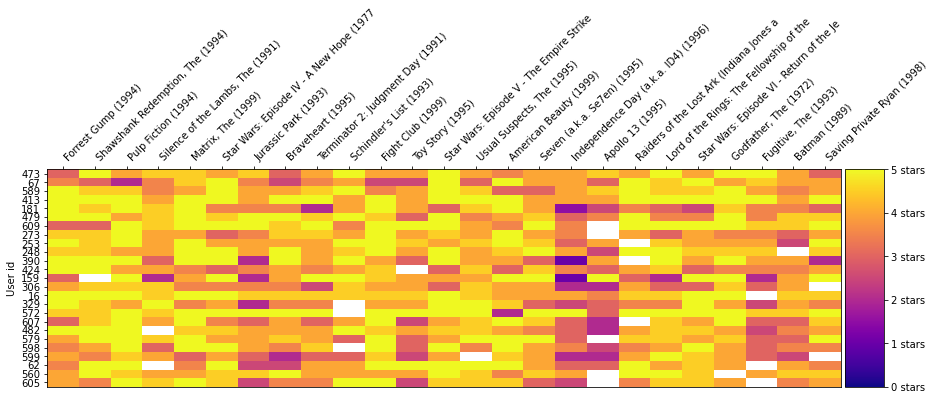

# Movie Recommender System Using K-Means Clustering
### Author: Virendrasinh Chavda

<p align="justify">
This repository contains a movie recommender system that leverages <strong>K-Means clustering</strong> to group users based on their movie preferences and recommend movies they are likely to enjoy. The project visualizes user-movie interactions through heatmaps and uses clustering techniques to identify patterns in ratings.
</p>

---

## Table of Contents
1. [Overview](#overview)
2. [Installation](#installation)
3. [Features](#features)
4. [Usage](#usage)
5. [Methodology](#methodology)
6. [Results](#results)
7. [Future Work](#future-work)
8. [Contributing](#contributing)
9. [License](#license)

---

## Overview

<p align="justify">
This project is a collaborative filtering-based movie recommender system. It uses user rating data to cluster users with similar preferences and recommend movies. By analyzing patterns in movie ratings, the system identifies user groups and their favorite movies. Heatmaps are used to visualize user-movie interactions for a better understanding of rating distributions.
</p>

---

## Installation

To set up and use this project, follow these steps:

1. Clone the repository:
   ```bash
   git clone https://github.com/VirendraChavda/Movie-Recommender.git
   cd movie-recommender-kmeans
   ```
2. Launch the Jupyter Notebook:
   ```bash
   jupyter notebook
   ```

## Features

### User Clustering
- Group users based on their movie rating patterns using K-Means clustering.
- Identify similar users to provide personalized recommendations.

### Heatmap Visualization
- Display user-movie interactions with a heatmap of ratings.
- Highlight rating trends across user groups and popular movies.

### Movie Recommendations
- Recommend movies to users based on their cluster assignments.
- Generate personalized suggestions using user similarity.

---

## Usage

### Data Preprocessing
- Use `movie_recommender_kmeans.ipynb` to load and preprocess the datasets:
  - <strong>`movies.csv`</strong>: Contains movie titles and metadata.
  - <strong>`ratings.csv`</strong>: Contains user ratings for movies.

### Run Clustering
- Perform K-Means clustering to group users with similar preferences.
- Visualize the clusters and analyze their characteristics.

### Generate Recommendations
- Assign users to clusters and recommend top-rated movies from their clusters.
- Use the notebook to test recommendations for specific users.

### Visualize Heatmap
- Generate a heatmap of user-movie interactions.

---

## Methodology

### Datasets
- <strong>`movies.csv`</strong>:
  - Contains metadata for movies, including titles and genres.
- <strong>`ratings.csv`</strong>:
  - Includes user ratings for movies (0 to 5 stars).

### Steps

#### Data Preprocessing
- Cleaned and transformed datasets for clustering.
- Created a user-movie rating matrix for analysis.

#### Clustering
- Applied K-Means clustering to group users based on their ratings.

#### Recommendation
- Recommended movies to users by identifying top-rated movies within their cluster.

#### Visualization
- Generated a heatmap to visualize the distribution of user ratings for movies.

---

## Results

### Heatmap of User-Movie Interactions
The heatmap below illustrates the interaction between users and movies, showing ratings from 0 to 5 stars:



### Clustering Insights
- Users are grouped into clusters based on their rating patterns.
- Movies within each cluster reflect the group's preferences, enabling personalized recommendations.

---

## Future Work

### Model Improvements
- Use advanced clustering algorithms like DBSCAN or Hierarchical Clustering for better user segmentation.

### Recommendation Enhancements
- Implement hybrid recommender systems that combine collaborative filtering and content-based methods.

### Scalability
- Optimize the system to handle larger datasets with millions of users and ratings.

---

## Contributing

Contributions are welcome! Feel free to fork the repository, make improvements, and submit a pull request. If you encounter any issues, open a GitHub issue for discussion.

---

## License

This project is licensed under the MIT License. See the [LICENSE](./LICENSE) file for more details.
